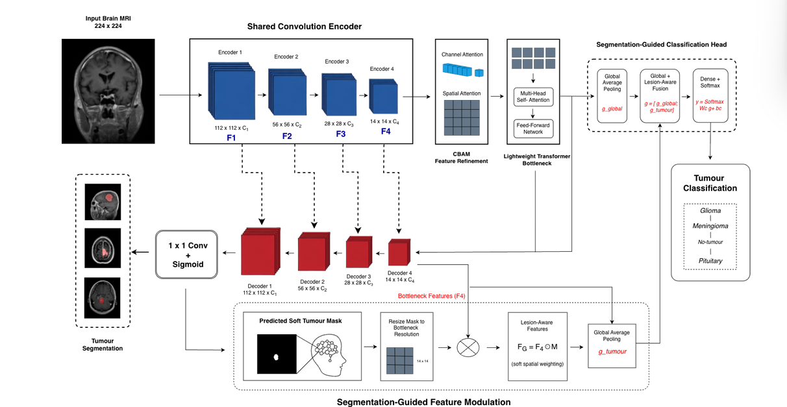

# BrainX-SegNet: A Segmentation-Guided Explainable Transformer-Attention Network for Brain Tumor MRI Classification and Localization

[](https://opensource.org/licenses/MIT)
[](https://tensorflow.org)
[](https://colab.research.google.com/github/YOUR_USERNAME/BrainX-SegNet/blob/main/BrainX_SegNet_Pipeline.ipynb)

Official implementation of **BrainX-SegNet**, a unified multi-task framework for simultaneous brain tumor MRI segmentation and classification[cite: 1].

---

## 📌 Architecture Overview



*Fig 1. Architecture of the proposed BrainX-SegNet, integrating CNN encoding, CBAM, Transformer-based context modelling, segmentation, and soft-mask-guided tumour classification.*

---

## 📌 Abstract
Accurate brain tumor analysis requires both reliable tumor-type classification and precise lesion localization[cite: 1]. **BrainX-SegNet** integrates a shared convolutional encoder, Convolutional Block Attention Modules (CBAM), a lightweight transformer bottleneck, a U-Net-style decoder, and a lesion-aware classification head guided directly by the predicted soft tumor mask[cite: 1].

---

## 📊 Key Results

Evaluating on the multi-task **BRISC dataset** test set[cite: 1]:
* **Classification Accuracy:** 97.79%[cite: 1]
* **AUC:** 99.85%[cite: 1]
* **Dice Score:** 0.7983[cite: 1]
* **IoU:** 0.7089[cite: 1]
* **Inference Speed:** ~175.58 FPS on an NVIDIA T4 GPU[cite: 1]

---

## 🏗️ Method Highlights

1. **Shared Convolution Encoder:** Extracts spatial features ($F1$ through $F4$) across multiple abstraction levels[cite: 1].
2. **CBAM Feature Refinement:** Refines feature maps using sequential channel and spatial attention modules[cite: 1].
3. **Lightweight Transformer Bottleneck:** Models long-range contextual relationships across patch embeddings[cite: 1].
4. **U-Net Decoder:** Upsamples representations to output a pixel-wise predicted soft tumor probability mask[cite: 1].
5. **Segmentation-Guided Feature Modulation:** Resizes the soft mask to match bottleneck resolution ($14 \times 14$), computes spatial element-wise multiplication ($F_G = F_4 \odot M$), and fuses local lesion-aware features ($g_{tumour}$) with global features ($g_{global}$)[cite: 1].
6. **Multi-Task Outputs:** Simultaneously yields predicted masks for tumor segmentation and 4-class classification (Glioma, Meningioma, No-tumour, Pituitary)[cite: 1].

---

## 🚀 Getting Started

### 1. Run in Google Colab
Click the badge above or click [here](https://colab.research.google.com/github/YOUR_USERNAME/BrainX-SegNet/blob/main/BrainX_SegNet_Pipeline.ipynb) to launch `BrainX_SegNet_Pipeline.ipynb` directly in Colab.

### 2. Local Setup
```bash
# Clone the repository
git clone [https://github.com/YOUR_USERNAME/BrainX-SegNet.git](https://github.com/YOUR_USERNAME/BrainX-SegNet.git)
cd BrainX-SegNet

# Install dependencies
pip install -r requirements.txt
